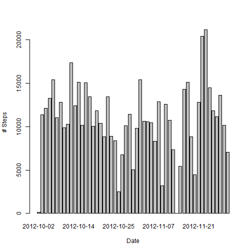
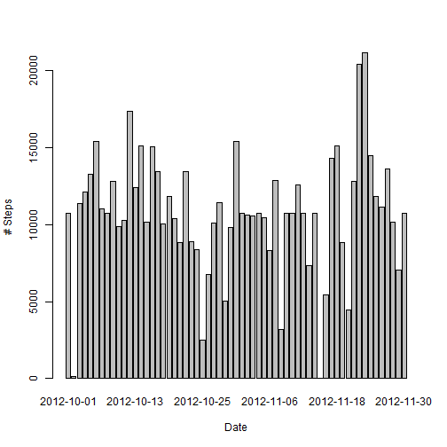
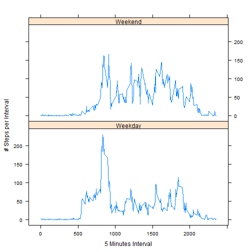

## Loading and preprocessing the data
1._Load the data (i.e. read.csv())
   (the data is expected to reside a specific directory under the name of "activity.csv")

```r
library("lattice")
library("timeDate")

Wrk_Path <- "S:/D/_Data_Management_Strategical/Data_Science/_COURSERA_STUFF/Course_5_Reproducible_Research/Peer_Assessment_1"
In_Path <- paste(Wrk_Path, "InputData", sep="/")
In_File <- paste(In_Path, "activity.csv", sep="/")
act <- read.csv(In_File)
```
- A quick overview of the data structure and contents:
  - a summary of the data frame
  - first and last 5 rows of data content
  - number of complete cases

```r
summary(act)
```

```
##      steps                date          interval     
##  Min.   :  0.00   2012-10-01:  288   Min.   :   0.0  
##  1st Qu.:  0.00   2012-10-02:  288   1st Qu.: 588.8  
##  Median :  0.00   2012-10-03:  288   Median :1177.5  
##  Mean   : 37.38   2012-10-04:  288   Mean   :1177.5  
##  3rd Qu.: 12.00   2012-10-05:  288   3rd Qu.:1766.2  
##  Max.   :806.00   2012-10-06:  288   Max.   :2355.0  
##  NA's   :2304     (Other)   :15840
```

```r
rbind(head(act, 5), tail(act, 5))
```

```
##       steps       date interval
## 1        NA 2012-10-01        0
## 2        NA 2012-10-01        5
## 3        NA 2012-10-01       10
## 4        NA 2012-10-01       15
## 5        NA 2012-10-01       20
## 17564    NA 2012-11-30     2335
## 17565    NA 2012-11-30     2340
## 17566    NA 2012-11-30     2345
## 17567    NA 2012-11-30     2350
## 17568    NA 2012-11-30     2355
```

```r
sum(complete.cases(act))
```

```
## [1] 15264
```

2._Process/transform the data (if necessary) into a format suitable for the analysis
- aggregation of data:
  - sum of steps per day
  - mean number of steps per 5 minutes interval

```r
 steps_d <- aggregate(
      steps ~ date, 
      data=act, 
      FUN=sum
      )
 head(steps_d, 5)
```

```
##         date steps
## 1 2012-10-02   126
## 2 2012-10-03 11352
## 3 2012-10-04 12116
## 4 2012-10-05 13294
## 5 2012-10-06 15420
```

```r
 steps_i <- aggregate(
      steps ~ interval, 
      data=act, 
      FUN=mean
      )
 head(steps_i, 5)
```

```
##   interval     steps
## 1        0 1.7169811
## 2        5 0.3396226
## 3       10 0.1320755
## 4       15 0.1509434
## 5       20 0.0754717
```

## What is mean total number of steps taken per day?
For this part of the work, missing values in the dataset are ignored.

1._Histogram of the <b>total number of steps</b> 
   taken <b>each day</b>


```r
barplot(steps_d$steps, 
        names.arg=steps_d$date, 
        xlab="Date", 
        ylab="# Steps"
        )
```

 

2._Calculate and report the <b>mean</b> 
   and <b>median total number of steps</b> 
   taken <b>per day</b>

```r
mean(steps_d$steps)
```

```
## [1] 10766.19
```

```r
median(steps_d$steps)
```

```
## [1] 10765
```

## What is the average daily activity pattern?
1._Time series plot (i.e. type = "l") of the <b>5-minute interval</b> (x-axis) 
   and the <b>average number of steps taken</b>, 
   <b>averaged across all days</b> (y-axis)

```r
plot(steps_i, type="l")
```

 


2._Which <b>5-minute interval</b>, 
   on average across all the days in the dataset, 
   contains the <b>maximum number of steps</b>?
   
- fetch the element number and display the contents 

```r
max_steps_element <- which.max(steps_i$steps)
steps_i[max_steps_element, ]
```

```
##     interval    steps
## 104      835 206.1698
```

## Imputing missing values
-  Calculate and report the total <b>number of missing values</b> in the
   dataset (i.e. the total number of rows with `NA`s)


```r
sum(!complete.cases(act))
```

```
## [1] 2304
```

-  Devise a <b>strategy for filling in all of the missing values</b> in the
   dataset. The strategy does not need to be sophisticated. For
   example, you could use the mean/median for that day, or the mean
   for that 5-minute interval, etc.

     - <b><i>The solution will use the mean for the 5-minute interval as  
       replacement for missing values.</i></b>
     

-  Create a new dataset that is equal to the original dataset but with
   the missing data filled in.


```r
## merge original activity data frame with interval data frame
my_act <- merge(act, 
                steps_i, 
                by = 'interval', 
                all.y = FALSE
                )

## replace NA values (in steps.x) with averages (in steps.y) rounded up as integers
my_act$steps.x[is.na(my_act$steps.x)] <- as.integer(round(my_act$steps.y[is.na(my_act$steps.x)]))

## drop obsolete column by renaming to original names and reordering identical to original data frame
names(my_act) <- c("interval", "steps","date","obsolete")
my_act <- my_act[names(act)]
```

-  Make a histogram of the total number of steps taken each day 
   and calculate and report the mean and median total number of steps taken per day.
   

```r
 my_steps_d <- aggregate(
          steps ~ date, 
          data=my_act, 
          FUN=sum
          )

barplot(my_steps_d$steps, 
        names.arg=my_steps_d$date, 
        xlab="Date", 
        ylab="# Steps"
        )
```

 

```r
mean(my_steps_d$steps)
```

```
## [1] 10765.64
```

```r
median(my_steps_d$steps)
```

```
## [1] 10762
```

- Do these values differ from the estimates from the first part of the assignment?

    - <i>I cannot see a major difference between the two patterns</i>
    - <i>However, the plot now shows <b>additional days</b> which were omitted in
      the original data due to the fact that they only contained N/A's</i>
   
   
- What is the impact of imputing missing data on the estimates of the total daily number of steps?
    - <i>Entire days of N/A data are now replaced by extrapolated data.
      Thus the result tends to be more complete and aligned</i>
    - <i>With no dramatic change on neither the histogram nor the mean/median values of the such
      completed data, we can assume that the overall meaning of the data is not falsified by 
      the approach taken</i>


## Are there differences in activity patterns between weekdays and weekends?
- My solution makes use of the "timeDate" R package (containing isWeekend/isWeekday functions)
- Properly aggregate the data for the graphical comparison of weekday and weekend activities
- Plot the data


```r
my_act$wknd <- isWeekend(my_act$date)
my_act$wknd <- gsub("FALSE", "Weekday", my_act$wknd)
my_act$wknd <- gsub("TRUE" , "Weekend", my_act$wknd)

my_act <- aggregate(
    data=my_act,
    steps ~ wknd + interval,
    FUN=mean
)

xyplot(
    layout=c(1,2),
    steps ~ interval | wknd,
    data=my_act,
    type="l",
    xlab="5 Minutes Interval",
    ylab="# Steps per Interval"
)
```

 

- <i>Conclusion: We can see a clear difference between weekend and weekday activities</i>
